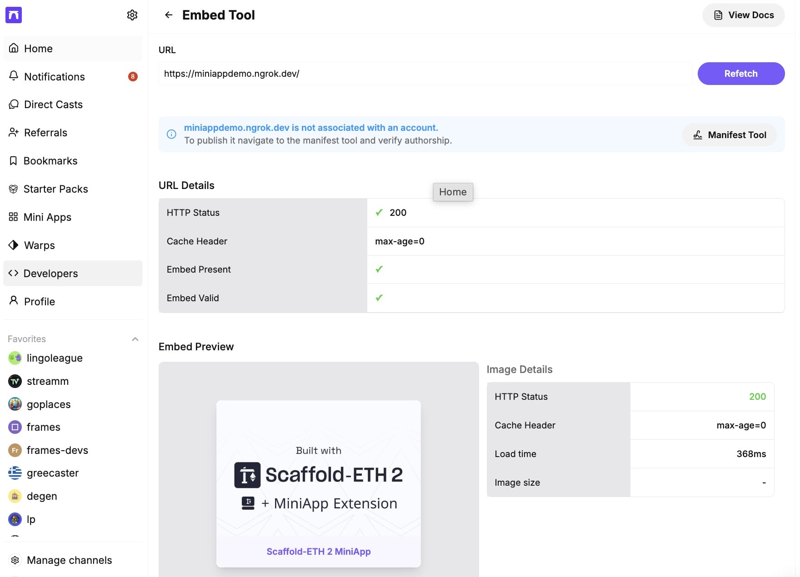

# Farcaster MiniApp Extension for SE-2

This extension provides basic functionality to start a Farcaster MiniApp development with [Scaffold-ETH 2](https://scaffoldeth.io)

## Requirements

According to [MiniApp SDK documentation](https://miniapps.farcaster.xyz/docs/getting-started):

Node.js 22.11.0 or higher (LTS version recommended)
- Check your version: ```node --version```
- Download from [nodejs.org](https://nodejs.org)


## Installation

1. Create a new project with MiniApp extension:

```typescript
npx create-eth@latest -e NikolaiL/miniapp
```

and 


2. Copy packages/nextjs/.env.example to packages/nextjs/.env


3. cd to your mini app dir and:


- Run a local network in the first terminal:
```typescript
yarn chain
```

- On a second terminal, deploy the test contract:
```typescript
yarn deploy
```

- On a third terminal, start your NextJS app:
```typescript
yarn start
```

 - On a fourth terminal, start ngrok (or other) externally available tunnel:

```typescript
ngrok http http://localhost:3000 --url https://yourminiapp.ngrok.dev
```


4. Update NEXT_PUBLIC_URL in packages/nextjs/.env for your domain

5. Go to https://farcaster.xyz/~/developers/mini-apps/embed , enter your app domain and you should see your miniapp embed rendered.


Your miniapp should load and show your Farcaster Wallet.




Renders as MiniApp in Farcaster Preview:


Base App preview:


And as a cast:

